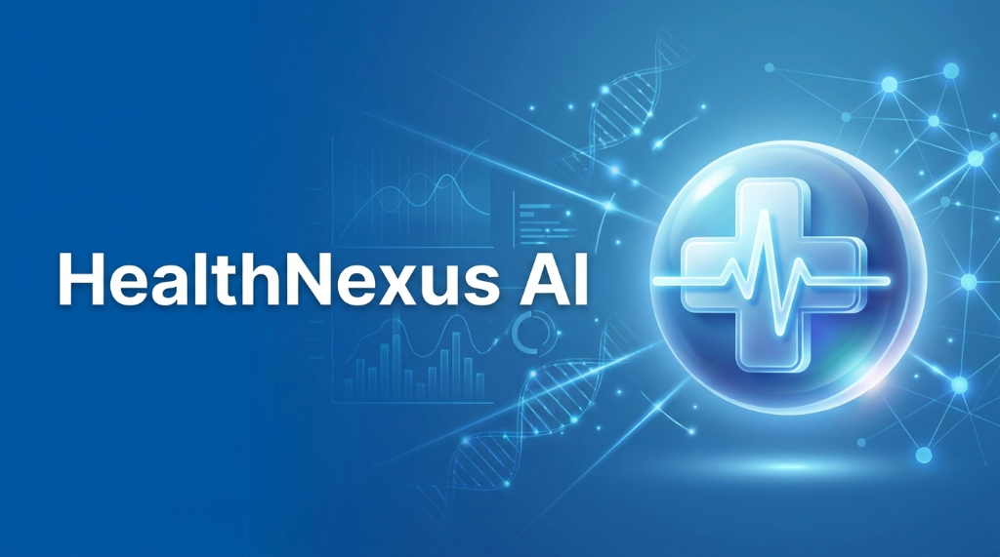
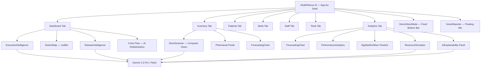
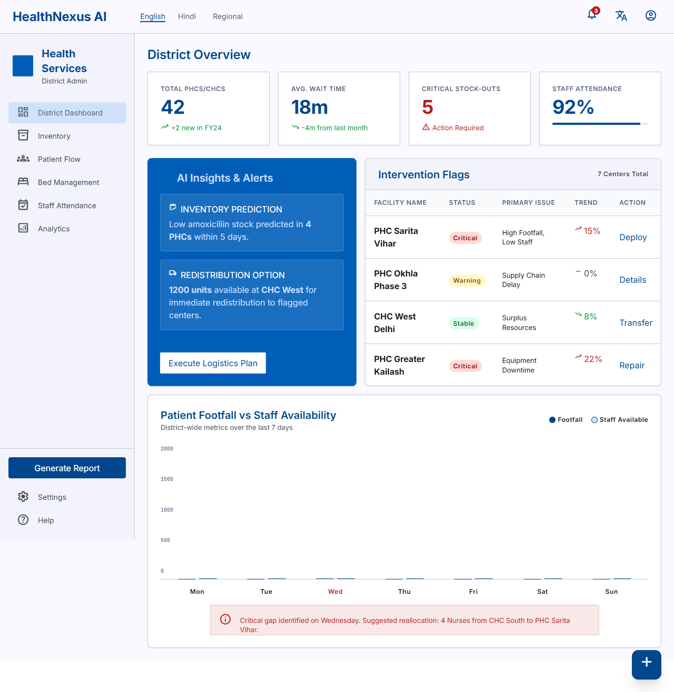
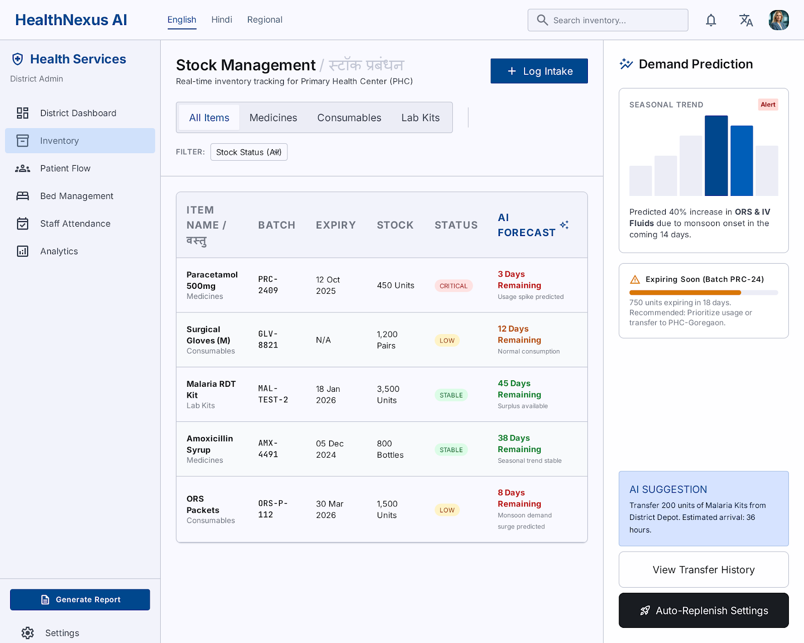
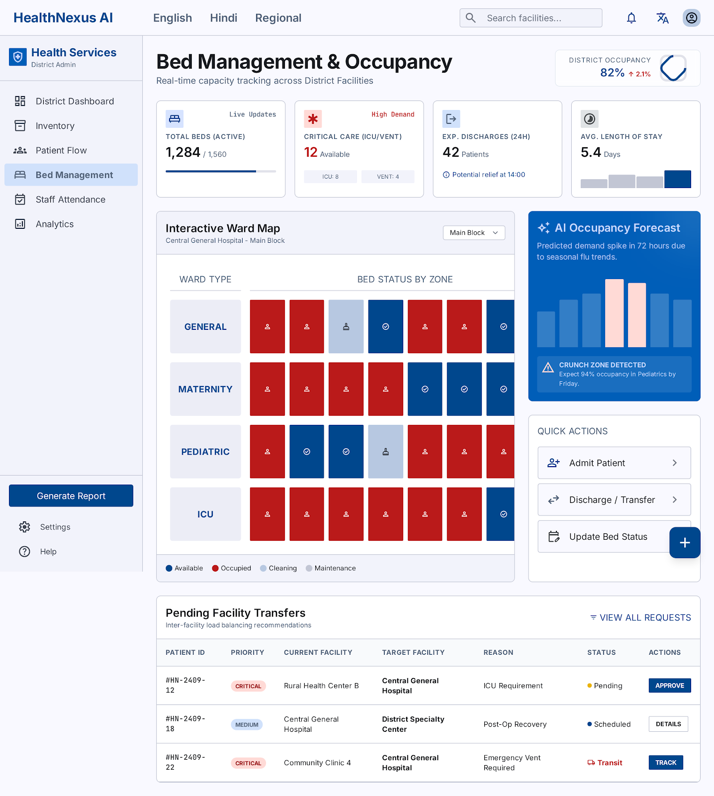
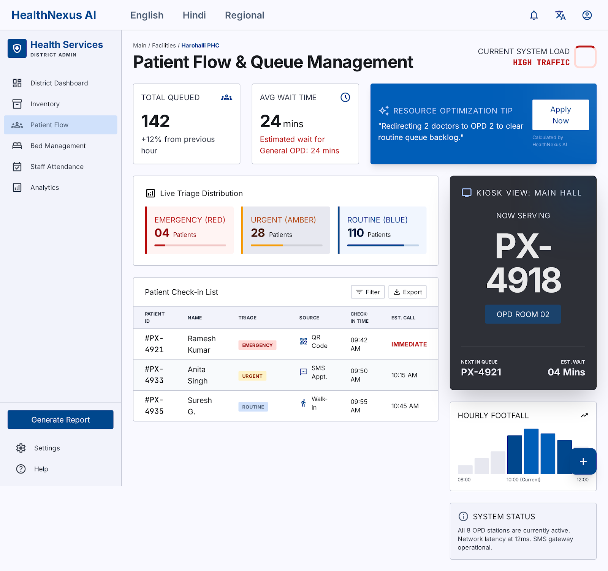
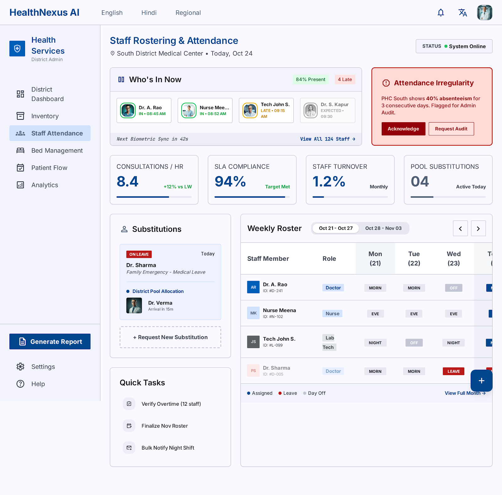
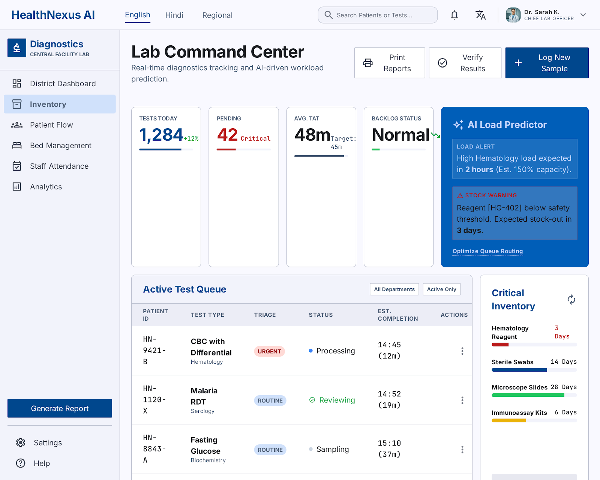

# HealthNexus AI — District Healthcare Operating System



> **Google GDG Hackathon 2024** — AI-powered district health intelligence platform for Alwar, Rajasthan (42 PHCs/CHCs).

[](https://ai.google.dev/)
[](https://react.dev/)
[](https://www.typescriptlang.org/)
[](https://web.dev/progressive-web-apps/)
[](https://vite.dev/)

---

## 🎯 The Problem

Rural district health infrastructure in India suffers from **operational blind spots** that cost lives:

| Pain Point | Impact |
|---|---|
| Manual medicine ledgers | Stock-outs discovered only at point of dispensing |
| No cross-facility visibility | Surplus at one PHC while another faces shortage |
| Reactive outbreak response | Disease clusters identified days after transmission begins |
| Paper-based staff rosters | Absenteeism gaps discovered during crisis, not before |
| No inter-facility bed routing | Patients turned away with no redirection |

**HealthNexus AI** transforms district healthcare from a passive, manual ledger system into an **active, AI-orchestrated District Healthcare Operating System** — real-time, predictive, explainable, and multilingual.

---

## 🌟 What HealthNexus AI Does

### 23 Phases of AI Capability — All Shipped

| # | Phase | Key Capability |
|---|---|---|
| 1 | Foundation & UX | Material-3 design, multilingual, responsive |
| 2 | District Digital Twin | Live Leaflet map of 42 facilities with AI risk markers |
| 3 | Resource Monitoring | Real-time inventory, beds, staff, footfall KPIs |
| 4 | AI Risk Engine | Composite 0–100 risk score per facility via Gemini |
| 5 | Predictive Analytics | 30-day inventory forecasting with confidence bands |
| 6 | Smart Redistribution | Surplus → deficit optimization with transport manifests |
| 7 | Explainable AI | Every prediction includes confidence, reasoning & action |
| 8 | Disease Intelligence | Outbreak hotspot detection, cluster heatmaps |
| 9 | AI Command Center | Central dashboard for district-level operations |
| 10 | AI Copilot | Natural language administrative query assistant |
| 11 | Voice Intelligence | Web Speech API + Gemini entity extraction |
| 12 | Computer Vision | Shelf scan simulation with bounding boxes & confidence |
| 13 | Resource Simulation | Scenario engine: Dengue / Flood / Heatwave / Strike |
| 14 | Emergency Response | One-click crisis simulation with automated redistribution |
| 15 | Intelligent Alerts | Priority-ranked (Critical → Low) notification system |
| 16 | AI Reporting | jsPDF client-side executive reports & transport manifests |
| 17 | Performance Analytics | Facility leaderboard with trend indicators & Most Improved |
| 18 | Autonomous Workflows | Nightly AI timeline: 6 automated overnight tasks |
| 19 | Security & Audit | Role switcher (Admin / Pharmacist / Doctor) + audit log |
| 20 | Demo Polish | Guided demo mode, 2G offline resilience |
| 21 | Executive Intelligence | District health score (0–100), operational priorities |
| 22 | AI Explainability Panel | "Why this?" evidence-backed reasoning for every AI action |
| 23 | Demo Story Mode | 6-step guided judge walkthrough — score 71 → 88 live |

---

## 🏗️ Architecture



### Technology Stack

| Layer | Technology |
|---|---|
| **UI Framework** | React 19, TypeScript (strict), Vite 8 |
| **Styling** | Vanilla CSS + Material Design 3 tokens (Stitch Design System) |
| **State** | Zustand (`useHealthStore`) with offline queue |
| **AI** | Google Gemini 1.5 Pro & Flash via `@google/generative-ai` |
| **Maps** | Leaflet + React-Leaflet (Alwar district bounding box) |
| **PDF** | jsPDF (client-side, no server) |
| **Voice** | Web Speech API + Gemini entity extraction |
| **PWA** | Vite PWA plugin + Workbox service worker |
| **Icons** | Google Material Symbols |
| **Fonts** | Inter, JetBrains Mono |

---

## 🗂️ Project Structure

```
src/
├── App.tsx                         ← Shell: router + tab switcher
├── store.ts                        ← Zustand global store
├── ai.ts                           ← Gemini API calls & fallback
├── data/
│   └── facilities.json             ← 42 PHCs/CHCs — Alwar district
└── modules/
    ├── map/
    │   └── DistrictMap.tsx         ← Interactive Leaflet district twin
    ├── ai/
    │   ├── riskEngine.ts           ← Composite risk scoring
    │   ├── forecasting.ts          ← 30-day demand forecasting
    │   └── ForecastingChart.tsx    ← Animated confidence-band chart
    ├── dashboard/
    │   ├── ExecutiveIntelligence.tsx   ← District health score + actions
    │   ├── DiseaseIntelligence.tsx     ← Outbreak heatmap + alerts
    │   ├── PerformanceAnalytics.tsx    ← Facility leaderboard
    │   ├── NightlyWorkflow.tsx         ← Autonomous AI timeline
    │   ├── AIExplainability.tsx        ← "Why this?" evidence panel
    │   └── DemoStoryMode.tsx           ← Guided judge walkthrough bar
    ├── inventory/
    │   └── StockScanner.tsx        ← Computer vision shelf scan
    ├── simulation/
    │   └── ResourceSimulator.tsx   ← Scenario engine: Before vs After
    └── voice/
        └── VoiceReporter.tsx       ← Speech-to-text + Gemini NER
```

---

## 🖥️ Screenshots

### 📊 District Overview & AI Command Centre


### 📦 Drug Inventory & Smart Redistribution


### 🛏️ Bed Availability & ICU Monitor


### 👥 Patient Flow & Triage Queue


### 📋 Biometric Staff Roster


### 🔬 Diagnostic IoT Labs Audit


---

## 🚀 Getting Started

### Prerequisites
- Node.js v20+
- Git

### 1. Clone
```bash
git clone https://github.com/AribAsim/HealthNexus-AI.git
cd HealthNexus-AI
```

### 2. Install
```bash
npm install
```

### 3. Configure Gemini API Key
```bash
cp .env.example .env
```
Edit `.env`:
```env
VITE_GEMINI_API_KEY=your_gemini_api_key_here
```
> **No API key?** The app gracefully falls back to a local AI simulation for offline demo use — full functionality, zero network dependency.

### 4. Run
```bash
npm run dev
# → http://localhost:5173
```

### 5. Build (Production)
```bash
npm run build
# PWA service worker + precache generated automatically
```

---

## 🎥 The Killer Demo — Judge Walkthrough

The **Demo Story Mode bar** at the bottom of the screen guides you through 6 steps automatically. Here's what each step reveals:

| Step | Action | What Judges See |
|---|---|---|
| 1 | **Live District Status** | 42 facilities on map, Health Score 71/100, 3 critical alerts |
| 2 | **AI Detects Crisis** | Amoxicillin stock-out warning + Dengue cluster in Tijara |
| 3 | **Computer Vision Scan** | AI shelf scan detects 3 low-stock items with bounding boxes |
| 4 | **Execute AI Response** | One click — redistribution dispatched, alerts sent |
| 5 | **Simulation Results** | Dengue scenario Before → After: risk score drops live |
| 6 | **Impact: Score 88/100** | District Health Score climbs **71 → 88**, ₹45k cost saved |

### Manual Demo Tips
- **Language Toggle:** Switch EN → हिंदी → Regional in the header
- **Voice Input:** Tap the microphone button — speak a facility update in any language
- **Offline Mode:** Toggle "Online" → "Offline" to demonstrate 2G resilience
- **AI Explainability:** Open Analytics → "AI Decision Explainability Panel" to show evidence

---

## 🤖 AI Capabilities — Gemini Integration

Every AI output follows the mandatory 4-field schema:

```typescript
interface AIOutput {
  prediction: unknown;        // the actual value (risk score, stockout date, etc.)
  confidence: number;         // 0–100
  explanation: string;        // human-readable reasoning
  recommendedAction: string;  // concrete next step
}
```

| Feature | Gemini Model | Fallback |
|---|---|---|
| Risk Score Engine | Gemini 1.5 Flash | Rule-based heuristic |
| Demand Forecasting | Gemini 1.5 Pro | Linear trend extrapolation |
| Voice Entity Extraction | Gemini 1.5 Flash | Regex pattern matching |
| Computer Vision Shelf Scan | Gemini Vision (mocked) | Static confidence overlay |
| AI Copilot Queries | Gemini 1.5 Pro | Canned response library |
| Executive Summary | Gemini 1.5 Pro | Template-based report |

---

## 📊 Hackathon Evaluation Alignment

| Criterion (Weight) | How HealthNexus AI Addresses It |
|---|---|
| **AI/Technical Execution (25%)** | Gemini powers risk scoring, forecasting, redistribution, voice NER, and report generation — all with real API calls and graceful fallback |
| **Deployability/Scalability (25%)** | PWA with offline cache, modular architecture, Zustand offline queue, 2G-compatible bundle (~280 KB gzip) |
| **Problem-Solution Fit (20%)** | Every feature maps directly to a documented PHC/CHC operational pain point (stock-outs, bed crunch, outbreak blindspots) |
| **Inclusivity (15%)** | EN/हिंदी/Regional language support, voice input, low-bandwidth mode, accessible WCAG contrast |
| **Impact Potential (10%)** | Scales to 42+ facilities; Scenario simulator demonstrates district-level coordination impact |
| **Presentation (5%)** | Demo Story Mode walks non-technical judges through the full narrative in under 5 minutes |

---

## 🛡️ Production Quality

```bash
# TypeScript strict check
npx tsc -b           # 0 errors, 239 modules

# Production build
npm run build        # PWA + Workbox generated

# Lint
npm run lint
```

- **0 TypeScript errors** (strict mode)
- **PWA** — installable, offline-first, Workbox precache
- **Security** — role-based access, audit log, no raw PII in state

---

## 📜 License

MIT License — Built with ❤️ for the **Google GDG Hackathon 2024**.

> *"From 71 to 88 — one AI response, lives protected."*
