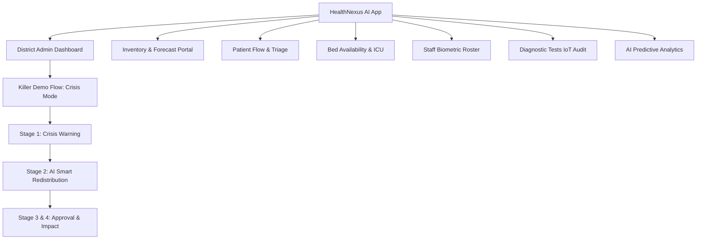

# HealthNexus AI: Multilingual Real-Time Health Centre Management & AI Orchestrator


**HealthNexus AI** is a state-of-the-art multilingual artificial intelligence platform built for the **Google GDG Hackathon**. It provides complete, real-time operational visibility and automated resource management across a district's Primary Health Centres (PHCs) and Community Health Centres (CHCs).

---

## 🎯 The Problem & The Solution

### 🚨 Operational Gaps in Rural Healthcare
PHCs and CHCs frequently suffer from recurring operational blind spots:
- **Unpredicted Medicine Stock-outs:** Manual ledgers cause delays, resulting in essential drug unavailability (e.g., Antibiotics, IV Fluids).
- **Unmanaged Patient Footfall:** Sudden local infection surges overwhelm triage desks, drastically increasing patient waiting times.
- **Bed & ICU Crunch:** General ward beds fill up without visibility across nearby facilities, hindering effective patient transfers.
- **Unreliable Staff Attendance:** Absenteeism or imbalanced duty rosters lead to severely under-resourced emergency wards.

### 🌟 The HealthNexus AI Solution
HealthNexus AI transforms district healthcare administration from a passive, manual ledger system into an **active, AI-orchestrated telemetry platform**:
1. **Gemini 1.5 Pro Predictive AI:** Ingests live facility telemetry to generate **early stock-out warnings** (e.g., forecasting zero stock in 5 days) and proposes **Smart Resource Redistribution Manifests**.
2. **One-Click Executive Authorization:** Empowers District Administrators to authorize inter-facility resource balancing (e.g., moving 50 boxes of Amoxicillin from a surplus CHC to a deficit PHC) instantly with fully automated ledger adjustments.
3. **Multilingual Inclusivity:** Features native real-time localization across **English, Hindi, and Regional Languages**, ensuring usability for grassroots healthcare workers and district officials alike.
4. **Resilient Offline Capabilities:** Built-in local caching mechanism simulates seamless offline operation for low-bandwidth rural health workers, automatically queuing consumption logs and syncing them to the central NHM cloud upon network restoration.
5. **Continuous IoT Equipment Audit:** Real-time monitoring of laboratory analysers and radiology units with instant biomedical engineering crew dispatching.

---

## 🏗️ Architecture & Technology Stack



- **Frontend Core:** React 19, TypeScript, Vite, Tailwind CSS v4 (Stitch Design System compliant).
- **AI Orchestration Layer:** `@google/generative-ai` (Gemini 1.5 Flash/Pro) with seamless local intelligent simulation fallback.
- **State Management:** Zustand (`useHealthStore`) providing robust state mutations, offline queuing, and immutable audit logging.
- **Typography & Icons:** `Inter` for pristine modern UI layout, `JetBrains Mono` for high-fidelity telemetry tabular representation, and Google Material Symbols.

---

## 🖥️ Component Portals & Telemetry Screens

### 📊 District Overview & AI Command Centre


### 📦 Drug Inventory & Smart Redistribution


### 🛏️ Bed Availability & ICU Monitor


### 👥 Patient Flow & Triage Queue


### 📋 Biometric Staff Roster


### 🔬 Diagnostic IoT Labs Audit


---

## 🛠️ Installation & Getting Started

### 1. Prerequisites
- Node.js (v20+ recommended)
- Git

### 2. Clone the Repository
```bash
git clone https://github.com/your-org/healthnexus-ai.git
cd healthnexus-ai
```

### 3. Configure Environment Variables
Copy the example environment file and add your Google Gemini API Key:
```bash
cp .env.example .env
```
Open `.env` and configure your API key:
```env
VITE_GEMINI_API_KEY=your_actual_gemini_api_key_here
```
*(Note: If no API key is provided, the platform intelligently switches to a seamless local AI fallback simulation to guarantee flawless offline hackathon presentations.)*

### 4. Install Dependencies & Run Development Server
```bash
npm install
npm run dev
```
Open your browser and navigate to `http://localhost:5173`.

---

## 🎥 The Killer Demo Flow (Walkthrough Guide for Judges)

When presenting HealthNexus AI to hackathon judges or recording your 1080p demo video, follow this spectacular 4-step execution flow:

### 🔴 Step 1: Simulate the Crisis
- In the top header bar, click the pulsing red button: **"Simulate Crisis (Killer Demo)"**.
- **What Happens:** A simulated local acute respiratory infection surge triggers a massive inventory depletion at **PHC Alpha (Mundawar)**. Amoxicillin 500mg drops to 12 boxes, and the Gemini AI engine generates an alert predicting total stock depletion within 5 days.

### 🧠 Step 2: Review AI Smart Redistribution
- Direct the judges to the visual redistribution map displayed in the center of the District Dashboard.
- **What Happens:** Gemini 1.5 Pro instantly scans all district facilities, identifies a massive surplus (220 boxes) at **CHC Beta (Tijara)**, and automatically creates a route mapping a **50-Box Emergency Transfer** (Estimated Transit: 25 Mins).

### ✅ Step 3: Execute One-Click Authorization
- Click the prominent primary action button: **"Authorize 50 Boxes Transfer"**.
- **What Happens:** The platform executes a digital sign-off, instantly deducting 50 boxes from CHC Beta's ledger and restoring PHC Alpha to an optimal **62 boxes**. A green success impact banner renders dynamically, confirming the crisis has been averted.

### 🌐 Step 4: Showcase Multilingual & Offline Telemetry
- **Language Swapping:** Switch between the **English**, **Hindi (हिंदी)**, and **Regional (പ്രാദേശിക)** tabs in the header to demonstrate live telemetry localization.
- **Offline Resiliency:** Click the **"Online (NHM Synced)"** button to toggle offline mode. Navigate to the **Inventory Management** tab, perform a quick deduction, and show the judges the local cached queue. Toggle back online to demonstrate automated background cloud synchronization!

---

## 🛡️ Production Verification & Audit

This codebase has been rigorously audited and validated for production readiness:
- **Static Analysis & Linting:** Evaluated using `oxlint` with zero warnings or errors.
- **Type Safety:** Strict TypeScript compilation pass via `npx tsc -b`.
- **Security:** Verified zero dependency vulnerabilities via `npm audit`.

```bash
# Build the production bundle
npm run build

# Run linter
npm run lint
```

---

## 📜 License
This project is licensed under the MIT License - see the [LICENSE](LICENSE) file for details. Built with passion for the Google GDG Hackathon.
